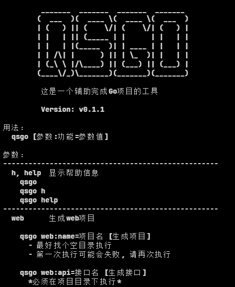
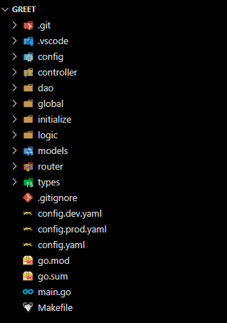
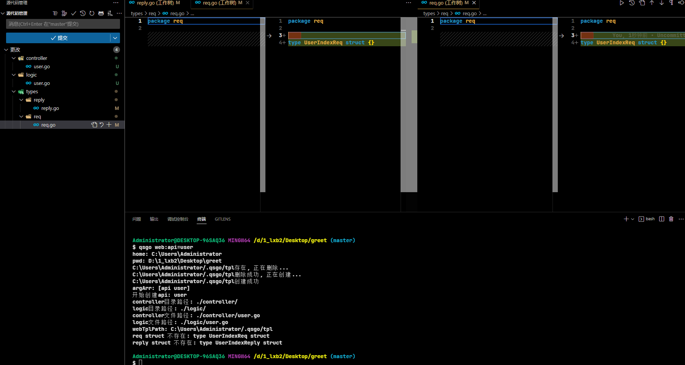
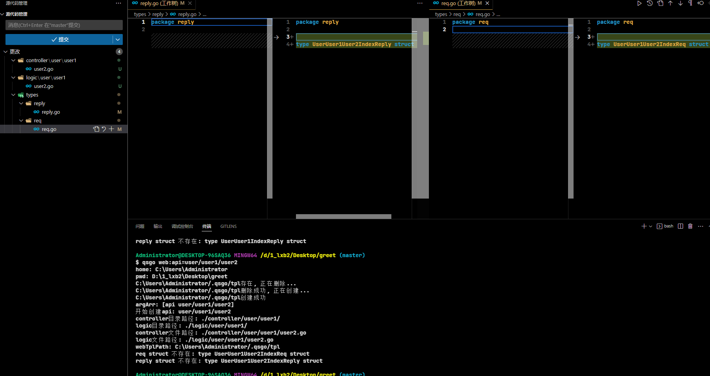

# qsgo
Go 的脚手架工具

## 下载
```shell
# 最新版本
go install github.com/liuxiaobopro/qsgo@latest
# 具体版本
go install github.com/liuxiaobopro/qsgo@v0.0.0

```

## 命令介绍

### qsgo | qsgo h | qsgo help
显示帮助信息



### qsgo web:name=项目名
创建一个web项目

```shell
#例如
qsgo web:name=greet
```

> 自动创建git仓库, 目录名见名知义

- 注意
  - **必须安装git**
  - 最好找个空目录执行
  - 第一次执行可能会失败, 请再次执行



### qsgo web:api=接口名
创建一个接口文件

```shell
#例如
qsgo web:api=user
qsgo web:api=user/user1/user2
```

- 注意
  - **必须在项目目录下执行**





## 已知问题

- [ ] `qsgo web:name=github.com/liuxiaobopro/qsgo` 创建带 `/` 的项目名会失败报错`修改文件夹名时出错： The system cannot find the path specified.`
- [ ] `qsgo web:name=github.com@liuxiaobopro@qsgo` 包名不符合`go.mod`的, `tidy`会失败

